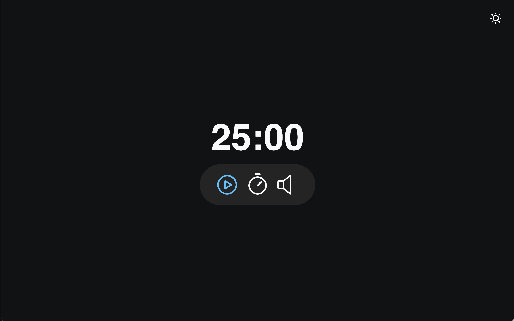

<p align="center">
    
</p>
<p align="center"><h1 align="center">FOCUSTIMER</h1></p>
<p align="center">
	<em>Focus, flow, conquer distractions, unleash productivity!</em>
</p>
<p align="center">
	
	
	
	
</p>
<p align="center"><!-- default option, no dependency badges. -->
</p>
<p align="center">
	<!-- default option, no dependency badges. -->
</p>
<br>

##  Table of Contents

- [ Overview](#-overview)
- [ Features](#-features)
- [ Project Structure](#-project-structure)
  - [ Project Index](#-project-index)
- [ Getting Started](#-getting-started)
  - [ Prerequisites](#-prerequisites)
  - [ Installation](#-installation)
  - [ Usage](#-usage)
  - [ Testing](#-testing)
- [ Project Roadmap](#-project-roadmap)
- [ Contributing](#-contributing)
- [ License](#-license)
- [ Acknowledgments](#-acknowledgments)

---

##  Overview

FocusTimer is a Pomodoro-style timer app that helps users stay focused and productive. With features like customizable light/dark modes, background music control, and precise timer settings, it creates an ideal work environment. Ideal for students, professionals, and anyone seeking structured work sessions with a touch of personalization.

---

##  Features

|      | Feature         | Summary       |
| :--- | :---:           | :---          |
| ⚙️  | **Architecture**  | <ul><li>Utilizes **JavaScript** as the primary language with **CSS** and **HTML** for styling and structure.</li><li>Follows a modular architecture with separate modules for timer, sounds, actions, elements, events, and state in the `FocusTimer` directory.</li><li>Implements a countdown feature in `timer.js` and manages user interactions in `events.js`, enhancing user experience and functionality.</li></ul> |
| 🔩 | **Code Quality**  | <ul><li>Well-structured codebase with clear separation of concerns into different modules within the `FocusTimer` directory.</li><li>Consistent coding style and naming conventions followed throughout the project.</li><li>Utilizes ES6 features like modules, arrow functions, and template literals for cleaner and more readable code.</li></ul> |
| 📄 | **Documentation** | <ul><li>Includes detailed documentation within the code files explaining the purpose and functionality of each module and file.</li><li>Code comments provide insights into the logic and implementation details, aiding in understanding and maintenance.</li><li>Documentation emphasizes the importance of each module in the overall project architecture.</li></ul> |
| 🔌 | **Integrations**  | <ul><li>Integrates audio assets for button press, kitchen timer, and background audio in the `sounds.js` module, enhancing user experience.</li><li>Interacts with DOM elements through the `elements.js` module to control the focus timer functionality.</li><li>Manages user interactions and timer actions through the `events.js` module, ensuring seamless integration with the UI.</li></ul> |
| 🧩 | **Modularity**    | <ul><li>Follows a modular approach with separate modules for distinct functionalities like timer, sounds, actions, elements, events, and state.</li><li>Encapsulates related functionality within each module, promoting code reusability and maintainability.</li><li>Modules communicate through well-defined interfaces, reducing dependencies and enhancing scalability.</li></ul> |
| 🧪 | **Testing**       | <ul><li>Testing details not provided in the context. Consider implementing unit tests for critical functionalities like timer logic, user interactions, and state management.</li><li>Adopt a test-driven development approach to ensure robustness and reliability of the project.</li><li>Explore tools like **Jest** or **Mocha** for writing and running tests efficiently.</li></ul> |
| ⚡️  | **Performance**   | <ul><li>Optimizes performance by efficiently updating the timer display with minutes and seconds, minimizing UI rendering overhead.</li><li>Utilizes state management to handle countdown logic and timer actions, ensuring smooth user experience.</li><li>Implements event handling for user interactions, enhancing responsiveness and interactivity.</li></ul> |

---

##  Project Structure

```sh
└── focustimer/
    ├── assets
    │   ├── bg-audio.mp3
    │   ├── button-press.wav
    │   ├── favicon.svg
    │   └── kichen-timer.mp3
    ├── index.html
    ├── src
    │   ├── FocusTimer
    │   ├── main.js
    │   └── toggle-mode.js
    └── style.css
```


###  Project Index
<details open>
	<summary><b><code>FOCUSTIMER/</code></b></summary>
	<details> <!-- __root__ Submodule -->
		<summary><b>__root__</b></summary>
		<blockquote>
			<table>
			<tr>
				<td><b><a href='https://github.com/maykbrito/focustimer/blob/master/style.css'>style.css</a></b></td>
				<td>- Define global styling and color variables for the project, including light mode adjustments<br>- Implement layout and styling rules for the main app components like timer and controls<br>- Toggle between different visual states based on user interactions, enhancing user experience and accessibility.</td>
			</tr>
			<tr>
				<td><b><a href='https://github.com/maykbrito/focustimer/blob/master/index.html'>index.html</a></b></td>
				<td>- Implements a Pomodoro-style timer with controls for starting, pausing, resetting, and adjusting the timer<br>- Includes options for toggling between light and dark modes, as well as controlling background music<br>- The timer displays minutes and seconds, providing a focused work environment.</td>
			</tr>
			</table>
		</blockquote>
	</details>
	<details> <!-- src Submodule -->
		<summary><b>src</b></summary>
		<blockquote>
			<table>
			<tr>
				<td><b><a href='https://github.com/maykbrito/focustimer/blob/master/src/main.js'>main.js</a></b></td>
				<td>- Initiates the focus timer functionality by importing and starting the timer with a specified duration<br>- The code sets up the core feature of the project, enabling users to engage in focused work sessions.</td>
			</tr>
			<tr>
				<td><b><a href='https://github.com/maykbrito/focustimer/blob/master/src/toggle-mode.js'>toggle-mode.js</a></b></td>
				<td>- Toggle mode functionality switches between light and dark modes on user interaction, updating the UI accordingly<br>- This feature enhances user experience by providing a customizable visual theme.</td>
			</tr>
			</table>
			<details>
				<summary><b>FocusTimer</b></summary>
				<blockquote>
					<table>
					<tr>
						<td><b><a href='https://github.com/maykbrito/focustimer/blob/master/src/FocusTimer/timer.js'>timer.js</a></b></td>
						<td>- Implements a timer countdown feature that updates the display with minutes and seconds<br>- Handles countdown logic, including decrementing time and triggering actions when the timer reaches zero<br>- Utilizes state management and element manipulation for seamless user experience in the FocusTimer project.</td>
					</tr>
					<tr>
						<td><b><a href='https://github.com/maykbrito/focustimer/blob/master/src/FocusTimer/sounds.js'>sounds.js</a></b></td>
						<td>Define and export audio assets for button press, kitchen timer, and background audio in the FocusTimer module.</td>
					</tr>
					<tr>
						<td><b><a href='https://github.com/maykbrito/focustimer/blob/master/src/FocusTimer/actions.js'>actions.js</a></b></td>
						<td>- Manages focus timer actions such as toggling running state, resetting timer, setting timer, and toggling music<br>- Updates UI elements and plays sounds accordingly<br>- Interacts with state, timer, elements, and sounds modules<br>- Key part of the focus timer functionality in the project architecture.</td>
					</tr>
					<tr>
						<td><b><a href='https://github.com/maykbrito/focustimer/blob/master/src/FocusTimer/elements.js'>elements.js</a></b></td>
						<td>- Expose DOM elements for controlling the focus timer<br>- The 'elements.js' file provides access to key elements like controls, minutes, and seconds, crucial for managing the timer functionality within the project architecture.</td>
					</tr>
					<tr>
						<td><b><a href='https://github.com/maykbrito/focustimer/blob/master/src/FocusTimer/events.js'>events.js</a></b></td>
						<td>- The code in `events.js` file registers and sets controls for a focus timer<br>- It handles user interactions like clicking controls and setting timer minutes<br>- This file plays a crucial role in managing user input and updating the timer display within the project's architecture.</td>
					</tr>
					<tr>
						<td><b><a href='https://github.com/maykbrito/focustimer/blob/master/src/FocusTimer/state.js'>state.js</a></b></td>
						<td>Manages the state for the Focus Timer feature, controlling the timer duration, running status, mute setting, and countdown ID.</td>
					</tr>
					<tr>
						<td><b><a href='https://github.com/maykbrito/focustimer/blob/master/src/FocusTimer/index.js'>index.js</a></b></td>
						<td>- The `index.js` file in the `FocusTimer` module initializes and starts the timer by setting the specified minutes and seconds, updating the display, and registering control events<br>- This file plays a crucial role in orchestrating the timer functionality within the project architecture.</td>
					</tr>
					</table>
				</blockquote>
			</details>
		</blockquote>
	</details>
</details>

---
##  Getting Started

###  Prerequisites

Before getting started with focustimer, ensure your runtime environment meets the following requirements:

- **Programming Language:** JavaScript


###  Installation

Install focustimer using one of the following methods:

**Build from source:**

1. Clone the focustimer repository:
```sh
❯ git clone https://github.com/maykbrito/focustimer
```

2. Navigate to the project directory:
```sh
❯ cd focustimer
```


###  Usage
Run focustimer using the following command:
`npx lite-server` 

---

##  Contributing

- **💬 [Join the Discussions](https://github.com/maykbrito/focustimer/discussions)**: Share your insights, provide feedback, or ask questions.
- **🐛 [Report Issues](https://github.com/maykbrito/focustimer/issues)**: Submit bugs found or log feature requests for the `focustimer` project.
- **💡 [Submit Pull Requests](https://github.com/maykbrito/focustimer/blob/main/CONTRIBUTING.md)**: Review open PRs, and submit your own PRs.

<details closed>
<summary>Contributing Guidelines</summary>

1. **Fork the Repository**: Start by forking the project repository to your github account.
2. **Clone Locally**: Clone the forked repository to your local machine using a git client.
   ```sh
   git clone https://github.com/maykbrito/focustimer
   ```
3. **Create a New Branch**: Always work on a new branch, giving it a descriptive name.
   ```sh
   git checkout -b new-feature-x
   ```
4. **Make Your Changes**: Develop and test your changes locally.
5. **Commit Your Changes**: Commit with a clear message describing your updates.
   ```sh
   git commit -m 'Implemented new feature x.'
   ```
6. **Push to github**: Push the changes to your forked repository.
   ```sh
   git push origin new-feature-x
   ```
7. **Submit a Pull Request**: Create a PR against the original project repository. Clearly describe the changes and their motivations.
8. **Review**: Once your PR is reviewed and approved, it will be merged into the main branch. Congratulations on your contribution!
</details>

<details closed>
<summary>Contributor Graph</summary>
<br>
<p align="left">
   <a href="https://github.com{/maykbrito/focustimer/}graphs/contributors">
      
   </a>
</p>
</details>

---
##  Thanks

Your are the best ⭐️ !

---
